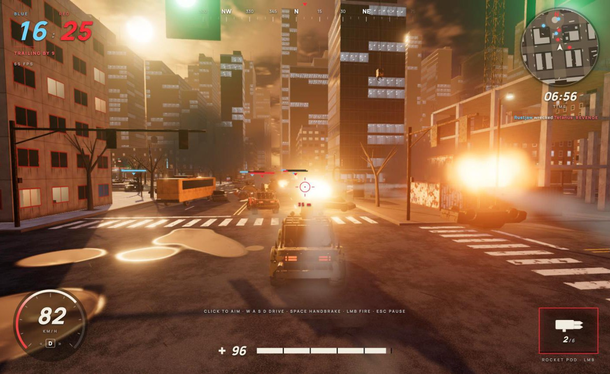
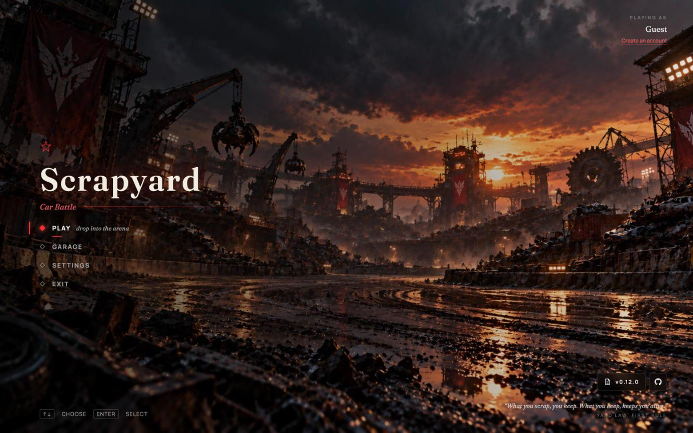
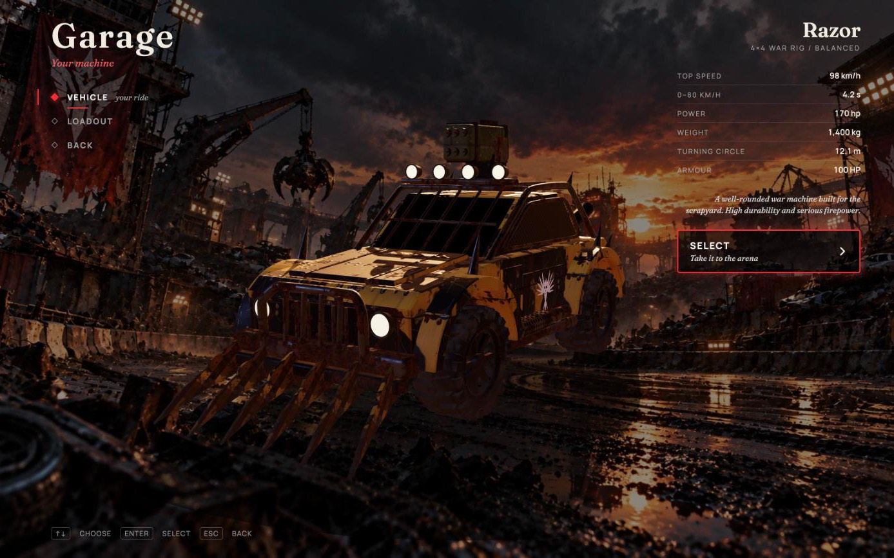
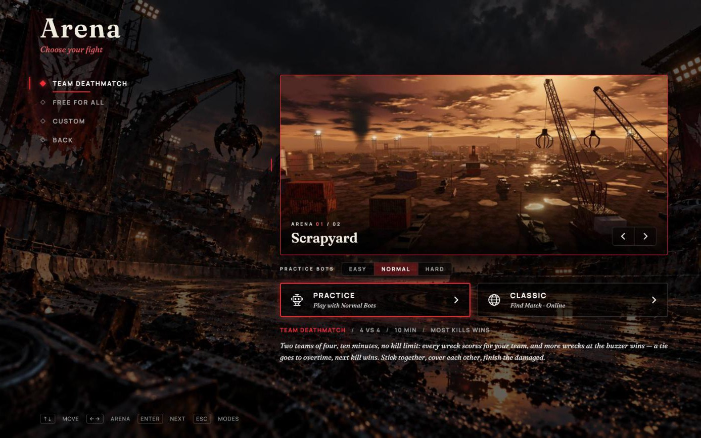
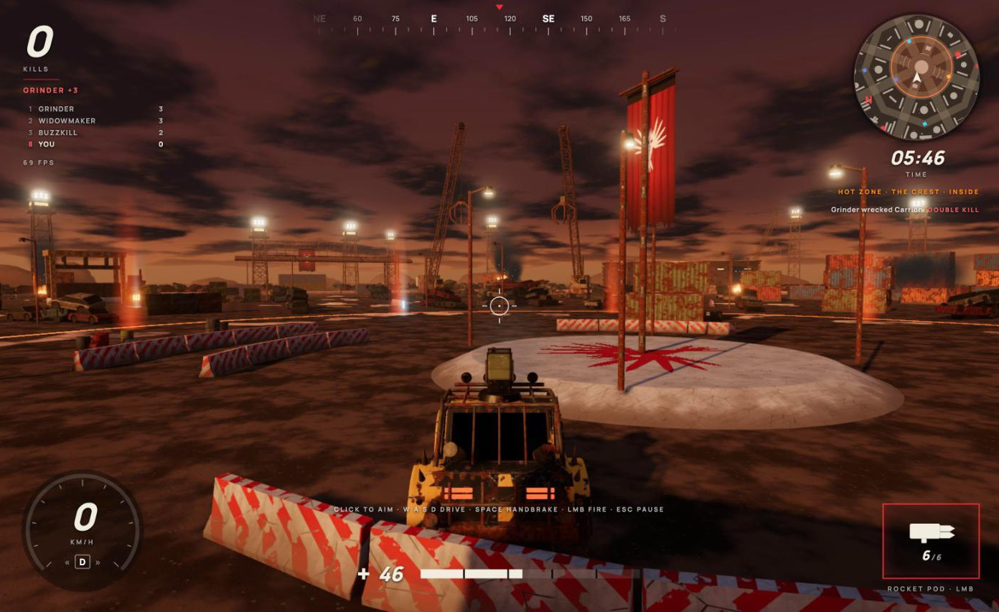
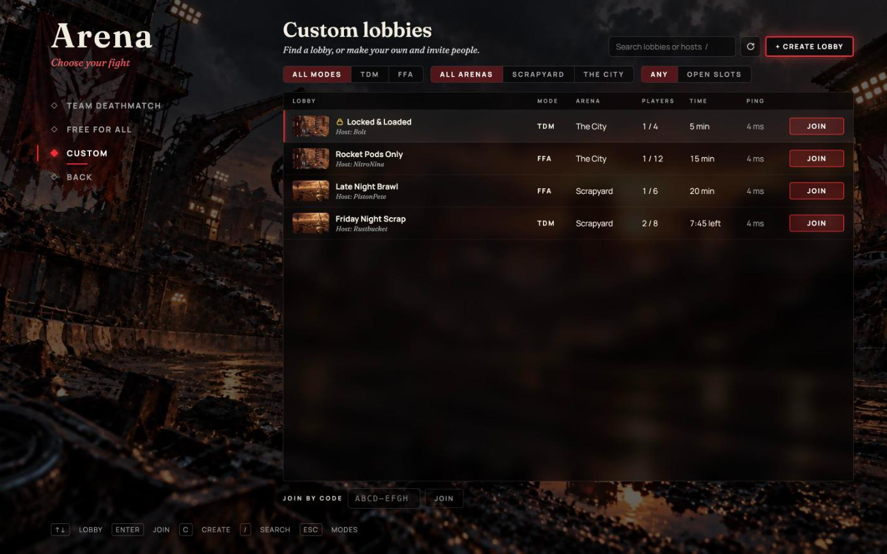
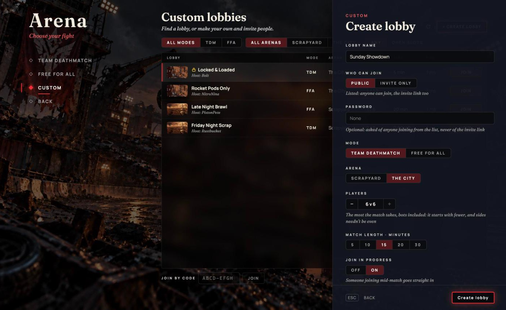
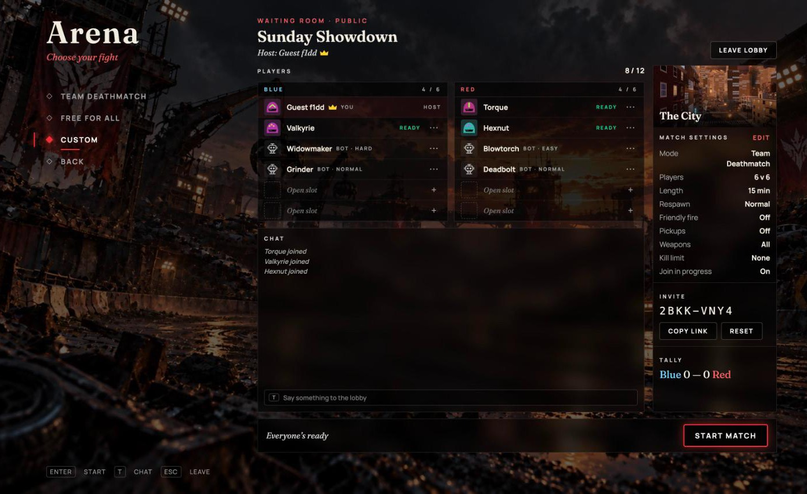

# Browser-based Multiplayer Vehicle Combat

<p align="center">
  
</p>

**Scrapyard** — multiplayer car combat in the browser. Armoured cars, a roof minigun or a rocket
pod, team deathmatch and free for all in a walled scrapyard or a burning city: practice against
bots, find an online match through matchmaking, or run your own custom lobby and invite people.

<p align="center">
  
</p>

## The game

- **Two modes.** Team Deathmatch: Blue against Red, every wreck scores for the team, a tie goes
  to overtime and the next kill wins, an MVP on the results. Free for All: eight machines, no
  allies, pickups dropping in waves from the two-minute mark (health, repair, ammo, speed,
  armour, damage boost) and a hot zone that moves around the arena.
- **Two arenas.** The Scrapyard, a walled octagon with the Crest at its heart, eight themed
  yards and crew bases at its gates; The City, a downtown street grid with themed blocks and a
  skyline.
- **Your machine.** A 4×4 war rig with a roof Minigun (a 60-round belt) or a Rocket Pod (six
  unguided rockets with a blast that shoves cars aside), picked in the garage. Respawns wait
  longer as the match goes on, with a moment of protection after; stuck on a wreck pile, R puts
  you back on the road.
- **Bots** at Easy, Normal or Hard: they lead moving targets, weave, take cover and lie in wait;
  in Team Deathmatch they play as a crew — helping a teammate under fire, flanking, finishing
  the damaged.
- **Classic online.** Find Match on the mode and arena you pick: eight at once, four or more
  after 10 seconds, any two after 30, a ready check, people taking over bots' seats. The search
  keeps going through a reload or a dropped connection.
- **Custom lobbies.** A list of public lobbies, or your own — public with an optional password,
  or invite only by code or link. The owner sets the match: 2 to 12 machines (1 v 1 to 6 v 6),
  5 to 30 minutes, join in progress, respawn speed, friendly fire, pickups, one gun for
  everyone, a kill limit; adds bots only where they want them; starts once everyone is ready.
  After each match everyone is back in the waiting room, the tally counting the wins.
- **Chat** in online matches — everyone, your team, whispers — and in a custom lobby's waiting
  room, carrying on into its match. Typing never drives your car.
- **Fair play.** The game server decides every hit, wreck and score; the browser only sends its
  controls. Every online match is recorded with signs of aim help for review, with a replay that
  runs the match again to the bit.
- **Accounts.** Play straight away as a guest, or make an account on the site to keep your name.

<table>
  <tr>
    <td></td>
    <td></td>
  </tr>
  <tr>
    <td></td>
    <td></td>
  </tr>
  <tr>
    <td></td>
    <td></td>
  </tr>
  <tr>
    <td colspan="2" align="center"></td>
  </tr>
</table>

The site's guide (`www/src/content/guide/`, served at `/docs`) has the rules, keys and numbers.

## How it's built

- **Game** (`game/`): React + Three.js + Rapier, TypeScript, Vite. The same simulation runs in
  the browser and on the authoritative game server (`game/server/`, Node + WebSocket): 60 steps
  a second on both, snapshots at 30, client prediction and interpolation, hitscan rewound to
  what the shooter saw. Custom lobbies live on the game server too.
- **Accounts** (`nakama/`): [Nakama](https://heroiclabs.com/nakama/) on Postgres, run with
  Podman — email accounts, guests, sessions, the match chat. Nakama never runs gameplay.
- **Site** (`www/`): Astro, static — home page, the guide, log in / register / account; serves
  the game at `/play`.
- **Server** (`deploy/`): Caddy, the game server, Nakama and Postgres in one compose file.

What changed in each version: [`CHANGELOG.md`](CHANGELOG.md); what players see, in the game's
patch notes (`game/src/screens/PatchNotesPanel.tsx`, on the main menu).

## Run it locally

Needs Node 24+ and Podman (with `podman compose`).

```sh
(cd game && npm ci) && (cd www && npm ci)
cp game/.env.example game/.env.local
cp www/.env.example www/.env
scripts/run.sh
```

`scripts/run.sh` starts Nakama (Podman), the game server on `:7360`, the game's dev server on
`:3000` and the site on `:8000`. The site serves the last game build at `/play`: run
`scripts/build.sh` once to make one. Ctrl-C stops the three servers; `cd nakama && podman
compose down` stops Nakama.

The `.env.example` files point at the local Nakama with its default keys; those are fine
locally and refused by the deploy.

## Checks

```sh
cd game && npm run lint && npm run build && npm run check   # check: simulation, rules, bots, protocol, lobbies, a real server over sockets
cd www && npm run lint && npm run check && npm run build
node scripts/nakama-smoke.mjs                              # against the running Nakama
```

CI (`.github/workflows/ci.yml`) runs the same on every pull request.

## Deploy

`.github/workflows/deploy.yml` builds and rolls a staging server after CI passes on `main`,
with no stored credentials (GitHub OIDC → GCP Workload Identity Federation → OS Login over
IAP). Its header lists the repository variables and secrets it needs; the server keeps its own
settings in `deploy/.env` (`deploy/.env.example`).

## License

MIT — see `LICENSE`.
